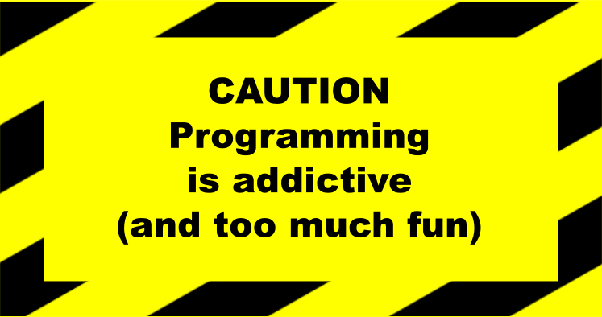

<h1>Kodehode Course Plan</h1>
    <h3>
        <a href="https://chriskodehub.github.io/kodehode-course-plan/">
            Live
        </a>
         | 
        <a href="https://jobloop.no/kodehode-modellen">
            Kodehode
        </a>
         | 
        <a href="https://github.com/chriskodehub/kodehode-course-plan/issues?q=is%3Aissue+is%3Aopen+label%3A%22help+wanted%22">
            Help wanted
        </a>
    </h3>
    
Application supporting the planning of teaching on the Kodehode course

     
    
Technologies and tools:

    
    
    
    
    
    
    
    

 

## Project assumptions

The project was made as part of learning programming at the Kodehode course.

### The topic of the project

An application that optimizes the management of teaching planning and accelerates the creation of a plan.

### Purpose of the project

1. The project aims to create an application that will streamline the process of planning tasks during the Kodehode
   course. The application also allows for quick changes to the schedule, especially in emergency cases, e.g. teacher's
   illness. In the application, it will be possible to plan teachers' leaves and quickly appoint replacements.
2. The other goal is the practical use of the knowledge acquired during the course and learning tools for project
   management and working in a programming team.

### Project description

The project aims to help the participants familiarize themselves with the programmer's practical example. The project
will start with the implementation.

## The way of working on the project

### Organization of work

1. The project will be carried out in the Scrum agile management methodology. [instruction]
2. By design, the organization of the project and the tools used to enable asynchronous work will suit our capabilities.
   With many responsibilities, it will be hard to get together every day.
3. The team will work and meet online unless there is an opportunity to meet in person.

### Tools

1. `GitHub` and its additional functionality:
    - Issues [instruction]
    - Projects [instruction]
    - Pull requests [instruction]
    - Fork [instruction]
2. `Git` on the local computer, and in particular:
    - Clone [instruction]
    - Branch [instruction]
    - Commit [instruction]
    - Pull [instruction]
    - Push [instruction]
3. `Google Jamboard` for
   brainstorming [[link]](https://jamboard.google.com/) [[instruction]](https://support.google.com/jamboard/?hl=en#topic=7383643)
4. `Google Drawings` for diagrams [instruction]
5. `Figma` for design [instruction]

## Help in creating the project

### Who can help?

Quick answer: EVERYONE 😁

It does not matter if you started yesterday or have been in Kodehode for a few weeks now. Any help is valuable, and
everyone can contribute to this beautiful project. Tasks are created so that everyone can find something they like.
There is work for Frontend and Backend for testers, designers and cybersecurity specialists.

### How can I help?

1. Do you have an interesting idea for new functionality? Do you know how you can improve UI or UX? Or maybe you would
   like to add something from yourself to the documentation? [instruction]
2. If you found a bug, you will be of great help if you report it on the appropriate form. [instruction]
3. When you notice that you can write a piece of code better, select it and send your proposal [instruction]
4. If you know the answer to any problem reported in `Issues`, help us solve it [instruction]
5. If you feel up to do `Fork` of the project, download it to your computer, correct the error, add new functionality,
   and send a `Pull Request` with your code. [instruction]

> Especially for beginners: D Issue submissions marked with the label: `good first issue` is always very easy to solve.
> This makes it easier for you to find the reporting and problem-solving system. [instruction]

### How to apply for help?

It could not be easier. Write a private message on Discord to our project coordinator [link]

## Work schedule

In progress...